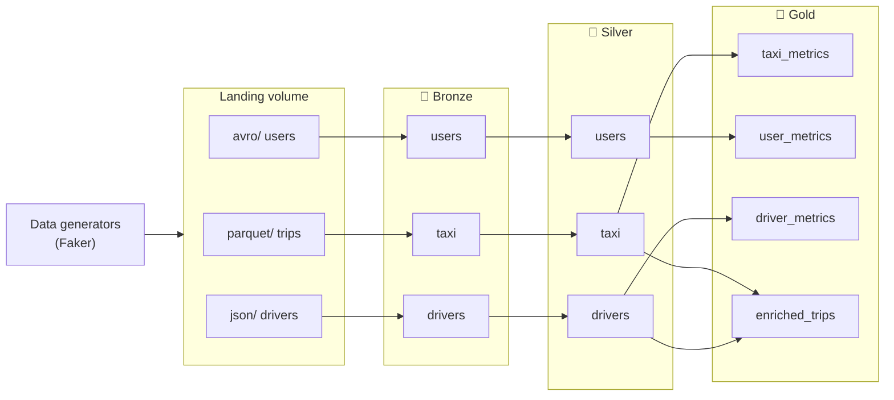

<div align="center">

# 🚕 Yandex Go Analytics

**A production-style Data Lakehouse on Databricks for ride-hailing analytics.**
Medallion architecture, incremental pipelines, infrastructure as code and CI/CD, all in one repo.


[**📚 Documentation**](https://stanislavpanfilenko.github.io/YandexGoAnalytics/) ·
[**🏗 Architecture**](https://stanislavpanfilenko.github.io/YandexGoAnalytics/architecture/) ·
[**🔎 API Reference**](https://stanislavpanfilenko.github.io/YandexGoAnalytics/api/)

</div>

---

## ✨ Highlights

- **Medallion architecture** on Unity Catalog: raw **Bronze**, validated **Silver**, business-ready **Gold**.
- **Incremental by design.** Auto Loader and Structured Streaming with `availableNow` and checkpoints: every run processes only new data and stops.
- **Two implementations of the same logic.** Reusable Python services (`src/core`) and a declarative **Delta Live Tables** pipeline with data-quality expectations.
- **Infrastructure as code.** Schemas, volume, pipeline and a scheduled job are shipped to `dev`, `staging` and `prod` with **Databricks Asset Bundles**.
- **Realistic test data.** Faker-based generators write Parquet, Avro and JSON files, with deliberately invalid rows so every quality rule has something to catch.
- **Built-in observability.** An audit report records existence, row count and latest Delta version of every table.
- **Engineering hygiene.** Typed code, Google-style docstrings, unit and integration tests, pre-commit, Ruff, MyPy, Bandit, pip-audit and Gitleaks.
- **Living documentation.** The API reference is generated from docstrings and published to GitHub Pages.

## 🧭 How it works



| Layer | What happens | Result |
|-------|--------------|--------|
| 🥉 **Bronze** | Auto Loader ingests files as-is and adds `_ingested_at` and `_source_file` | Raw, append-only Delta tables |
| 🥈 **Silver** | Invalid rows are filtered, payment types decoded, duplicates removed | Clean `taxi`, `users`, `drivers` |
| 🥇 **Gold** | Aggregations and a trips-with-drivers join | Revenue by zone and payment type, driver ratings by experience, daily registrations, enriched trips |

## 🛠 Tech stack

| Area | Technology |
|------|------------|
| Platform | Databricks serverless, Unity Catalog, Delta Lake, Auto Loader, Delta Live Tables |
| Language | Python 3.12, PySpark, `databricks-connect` |
| Models and data | Spark schemas, Pydantic v2, Faker |
| Deployment | Databricks Asset Bundles, GitHub Actions |
| Quality | pytest, Ruff, MyPy, pre-commit |
| Security | Bandit, pip-audit, Gitleaks |
| Docs | MkDocs Material, mkdocstrings |

## 🚀 Quick start

> **Prerequisites:** Python 3.12, [uv](https://docs.astral.sh/uv/) (or pip), the
> [Databricks CLI](https://docs.databricks.com/dev-tools/cli/) and a Databricks workspace.

```bash
# 1. Install
git clone https://github.com/stanislavpanfilenko/YandexGoAnalytics.git
cd YandexGoAnalytics
uv sync                     # or: pip install -e .

# 2. Configure
cp .env.example .env        # fill in the values below
databricks auth login --host https://<your-workspace>.cloud.databricks.com
```

```dotenv
DATABRICKS_HOST=https://<your-workspace>.cloud.databricks.com
DATABRICKS_CATALOG=yandex_go_dev
DATABRICKS_ENV=dev
```

```bash
# 3. Verify the code
make check                  # format check, lint, type check
make test                   # unit tests, no Databricks needed

# 4. Deploy and run
make deploy-dev             # schemas, volume, pipeline and job
make run-trips-dev          # run the Trips DLT pipeline
```

### Use the services from Python

```python
from src.core.etl.bronze import TaxiTripBatchIngestionService
from src.core.infra.connection.databricks_connector import DatabricksConnectionService
from src.core.utils.data_generation import TripGenerator

with DatabricksConnectionService("yandex-go") as conn:
    spark = conn.spark

    TripGenerator(subfolder="parquet").generate(spark, row_count=1000)  # fake files -> landing
    TaxiTripBatchIngestionService().run(spark)  # landing -> bronze.taxi
```

`DatabricksConnectionService` works both inside Databricks (reuses the active session) and locally
(serverless session through Databricks Connect). Silver and Gold services are used the same way.

## 🌍 Environments

| Target | Catalog | Git branch |
|--------|---------|------------|
| `dev` (default) | `yandex_go_dev` | `development` |
| `staging` | `yandex_go_staging` | `staging` |
| `prod` | `yandex_go_prod` | `production` |

A push to a branch deploys the matching target. Pull requests run quality, test and security checks.

## 🔁 CI/CD

| Workflow | Trigger | Does |
|----------|---------|------|
| **Code Quality & Tests** | Pull request | Ruff, MyPy, unit tests, integration tests, `bundle validate` |
| **Deploy to Target** | Push to a branch, manual run | `databricks bundle deploy` to the matching target |
| **Security Scans** | Pull request, push, weekly | Gitleaks, pip-audit, Bandit |
| **Documentation** | Pull request, push to `production` | Strict docs build, publish to GitHub Pages |

## 🧪 Testing

| Suite | Runs against | Command |
|-------|--------------|---------|
| Unit | A mocked `SparkSession`, no Databricks needed | `make test` |
| Integration | A real serverless Databricks session | `make test-integration` |

## 🧰 Useful commands

Run `make` to see all targets. The most used:

| Command | Purpose |
|---------|---------|
| `make fix` | Format and auto-fix lint errors |
| `make check` | Format check, lint and type check |
| `make security` | Bandit and pip-audit |
| `make validate` | Validate the bundle (`TARGET=dev` by default) |
| `make deploy TARGET=prod` | Deploy to an environment |
| `make deploy-and-run-trips` | Deploy, then run the Trips pipeline |
| `make docs` | Live documentation preview |

<details>
<summary><b>📁 Repository layout</b></summary>

```text
.
├── databricks.yml               # bundle variables and targets
├── resources/                   # schemas, volume, DLT pipeline, scheduled job, dashboards
├── src/
│   ├── core/                    # reusable Python package
│   │   ├── config/              #   environment variables
│   │   ├── infra/               #   Databricks connection, audit report
│   │   ├── schemas/             #   Spark schemas and Pydantic report models
│   │   ├── etl/                 #   bronze / silver / gold services
│   │   └── utils/data_generation/   synthetic data generators
│   ├── dlt_pipelines/           # Delta Live Tables notebooks
│   └── notebooks/               # step-by-step walkthrough
├── tests/                       # unit, integration, fixtures
├── docs/                        # MkDocs site sources
└── .github/workflows/           # CI/CD
```

</details>

## 🗺 Ideas for the future

- Deploy the Lakeview dashboards that are already defined in `resources/dashboards/`.
- Share the business rules between the Python services and the DLT pipeline to avoid keeping two copies in sync.
- Incremental Gold aggregation instead of full recompute for very large inputs.

## 📖 Documentation

Full documentation, including architecture diagrams and a generated API reference, to build it locally: `make docs`.

## 👤 Author

**Stanislav Panfilenko**, [@stanislavpanfilenko](https://github.com/PanAnastasiy)

## 📄 License

Released under the [MIT License](LICENSE).
