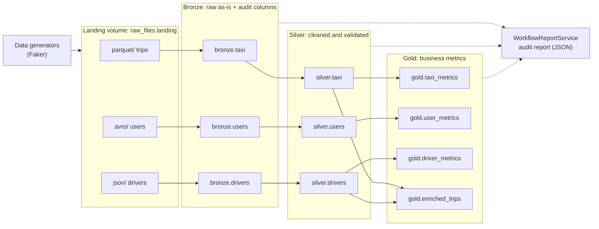
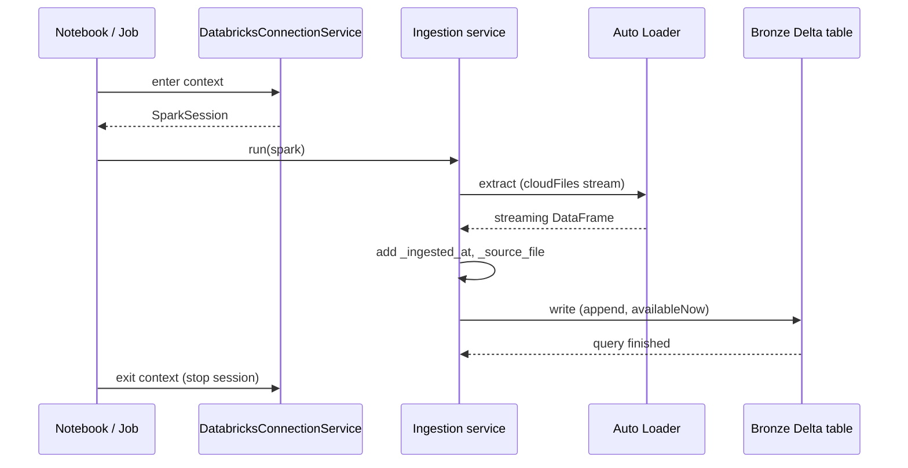
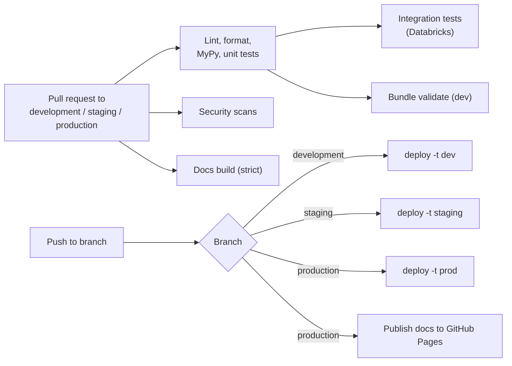

# Architecture

This page explains how the platform is built: how data moves, how the code is organised, and how
it is deployed. For class-level detail see the [API Reference](api.md).

## Design principles

| Principle | How it shows up |
|-----------|-----------------|
| **Medallion layers** | Data quality increases at each step: raw (Bronze), validated (Silver), aggregated (Gold). |
| **Incremental by default** | Every stream runs with `availableNow=True` and a checkpoint, so each run processes only new data and then stops. |
| **Template method** | Each layer has a base class that fixes the `extract → transform → load → run` skeleton. Entities only supply what differs. |
| **One source of configuration** | Environment variables are read in `core.config` only. |
| **Infrastructure as code** | Schemas, volumes, the pipeline and the job live in `resources/` and are deployed by a bundle. |
| **Environments are data** | `dev`, `staging` and `prod` differ only by bundle variables (catalog, environment name). |

## Data flow



All tables live in Unity Catalog under `<catalog>.<layer>.<table>`; the catalog depends on the
environment (`yandex_go_dev`, `yandex_go_staging`, `yandex_go_prod`).

### Landing

Files arrive in the managed volume `raw_files.landing`, one sub-folder per format:

| Folder | Format | Entity |
|--------|--------|--------|
| `parquet/` | Parquet | Taxi trips |
| `avro/` | Avro | Users |
| `json/` | JSON | Drivers (arrives as a stream of files) |

Besides raw files the volume holds technical data: `_checkpoints/` (streaming state and Auto Loader
schemas) and `reports/workflow_summary.json` (the audit report).

### Bronze: raw, append-only

Bronze keeps the source data unchanged and adds two audit columns.

| Column | Meaning |
|--------|---------|
| `_ingested_at` | Timestamp of ingestion |
| `_source_file` | Path of the file the row came from |

Files are read with Auto Loader (`cloudFiles`) and written to Delta in append mode. The drivers
stream applies `DriverSchema` as schema hints, and the DLT version also enables schema evolution
(`addNewColumns`) for it, so new JSON fields do not break ingestion.

### Silver: cleaned and validated

| Table | Rules |
|-------|-------|
| `silver.taxi` | Keep rows with `passenger_count`, `trip_distance` and `fare_amount` greater than 0. Decode `payment_type` into `payment_type_description` (1 = Credit Card, 2 = Cash, otherwise Other). Deduplicate by `user_id`, `driver_id`, `pickup_datetime`, `dropoff_datetime`. |
| `silver.drivers` | Keep rows with `experience > 0` and `rating` between 1.0 and 5.0. Deduplicate by `id`. |
| `silver.users` | Drop rows without `full_name`. Replace a missing `email` with `"Unknown"`. Deduplicate by `email`. |

Every Silver table gets a `_processed_at` timestamp.

!!! warning "Users deduplication"
    Missing emails are replaced with `"Unknown"` before deduplication by `email`, so all users
    without an email collapse into a single row. Keep this in mind when reading user counts.

### Gold: business metrics

| Table | Grain | Measures |
|-------|-------|----------|
| `gold.taxi_metrics` | Pickup zone (`pu_location_id`) × `payment_type_description` | `total_trips`, `total_revenue` |
| `gold.driver_metrics` | `experience` | `drivers_count`, `avg_rating` |
| `gold.user_metrics` | `registration_date` | `users_count` |
| `gold.enriched_trips` | One row per trip (deduplicated by `id`) | Trip columns plus `driver_name`, `driver_car_number`, `driver_experience`, `driver_rating` (and `driver_phone` if present) from a left join with `silver.drivers` |

Aggregates carry a `_calculated_at` timestamp. After each write the services run `OPTIMIZE`;
`gold.driver_metrics` additionally uses `ZORDER BY (experience)` and `gold.taxi_metrics` uses
Liquid Clustering on `pu_location_id`.

## Two ways to run the pipeline

The same business logic exists in two forms. They are independent: use whichever fits the task.

| | Python services (`src/core`) | Delta Live Tables (`src/dlt_pipelines`) |
|---|---|---|
| **Style** | Imperative classes you call from a notebook, job or script | Declarative tables; DLT resolves dependencies |
| **Tables** | `bronze.taxi`, `silver.taxi`, `gold.taxi_metrics` in the layer schemas | `bronze_taxi`, `silver_taxi`, `gold_*` in the pipeline target schema `trips_dlt` |
| **Data quality** | Explicit filters in `transform` | `@dlt.expect_all_or_drop` expectations |
| **Incremental state** | Structured Streaming, `availableNow`, checkpoints in the landing volume | Managed by DLT |
| **Runs via** | `service.run(spark)` | `databricks bundle run yandex_go_trips_pipeline` or the scheduled job |
| **Used for** | Development, walkthrough notebooks, reusable library code | Production-style scheduled runs |

## Code architecture

### Package layout

```text
src/core
├── config/            get_catalog(), get_environment()
├── infra/
│   ├── connection/    BaseConnectionService, DatabricksConnectionService
│   └── audit/         WorkflowReportService
├── schemas/           Spark schemas (driver, user, trip) + Pydantic report models
├── etl/
│   ├── bronze/        Ingestion services
│   ├── silver/        Transformation services
│   └── gold/          Aggregation services
└── utils/data_generation/   File generators for the landing volume
```

Dependencies point one way: `etl`, `utils` and `infra` may use `config` and `schemas`; `config`
and `schemas` import nothing from the rest.

### Class model

```mermaid
classDiagram
    class BaseIngestionService {
        +extract(spark)
        +add_audit_metadata(df)
        +load(df)
        +run(spark)
    }
    BaseIngestionService <|-- TaxiTripBatchIngestionService
    BaseIngestionService <|-- UserBatchIngestionService
    BaseIngestionService <|-- DriverStreamingIngestionService

    class BaseTransformationService {
        +extract(spark)
        +transform(df)*
        +load(df)
        +run(spark)
    }
    BaseTransformationService <|-- TripSilverTransformationService
    BaseTransformationService <|-- DriverSilverTransformationService
    BaseTransformationService <|-- UserSilverTransformationService

    class BaseAggregationService {
        +extract_stream(spark)
        +transform_stream(df)*
        +optimize(spark)
        +run(spark)
    }
    BaseAggregationService <|-- TripGoldMetricsService
    BaseAggregationService <|-- DriverGoldMetricsService
    BaseAggregationService <|-- UserGoldMetricsService

    class EnrichedTripsGoldService {
        +run(spark)
    }

    class BaseConnectionService {
        +connect()*
        +disconnect()*
    }
    BaseConnectionService <|-- DatabricksConnectionService

    class BaseFileGenerator {
        +generate(spark, row_count)*
    }
    BaseFileGenerator <|-- TripGenerator
    BaseFileGenerator <|-- UserGenerator
    BaseFileGenerator <|-- DriverGenerator
```



`*` marks methods a subclass must implement. A new entity usually needs one small subclass per
layer, and the base class supplies the streaming, checkpoint and logging logic.

### Typical run



### Spark connection

`DatabricksConnectionService` is a context manager that hides where the code runs:

- **Inside Databricks** it reuses the active session of the runtime and leaves it running on exit.
- **Elsewhere** (laptop, CI) it opens a serverless session through `databricks-connect` and stops
  it on exit.

It raises `DatabricksConnectionError` when no session can be created, for example when
`databricks-connect` is missing or the session is accessed before connecting.

## Incremental processing and state

| Layer | Read | Write | Checkpoint path (inside `raw_files.landing`) |
|-------|------|-------|----------------------------------------------|
| Bronze | Auto Loader (`cloudFiles`) | Append, `availableNow` | `_checkpoints/bronze/<table>/data` (Auto Loader schema in `.../schema`) |
| Silver | Delta stream with `ignoreChanges` | Append, `availableNow` | `_checkpoints/silver/<table>/data` |
| Gold aggregates | Delta stream with `ignoreChanges` | **Complete** output mode, `availableNow` | `_checkpoints/gold/<table>/data` |
| Gold `enriched_trips` | Trips stream joined with a static drivers snapshot | Append, `availableNow` | `_checkpoints/gold/enriched_trips/data` |

`availableNow` makes each run behave like a batch job that resumes exactly where the last one
stopped. Aggregates use complete mode: the whole (small) result is recomputed on every run, which
keeps them consistent without incremental merge logic.

## Configuration

| Variable | Required | Used by |
|----------|----------|---------|
| `DATABRICKS_CATALOG` | Yes | `get_catalog()`, every service and generator |
| `DATABRICKS_ENV` | Yes | `get_environment()` |
| `DATABRICKS_HOST` | For CLI, `make` and Databricks Connect | Databricks tooling |
| `DATABRICKS_TOKEN` | In CI or token-based auth | Databricks tooling |

A missing required variable raises a `RuntimeError` with the variable name instead of silently
falling back to a default. Locally the variables come from `.env` (loaded with `python-dotenv`);
on Databricks they come from the compute or job configuration. Schema and volume names are fixed
by the project: `raw_files`, `bronze`, `silver`, `gold` and the `landing` volume.

## Infrastructure as code

Everything is declared in the bundle and created by `databricks bundle deploy -t <target>`.

| Resource | File | Details |
|----------|------|---------|
| Variables and targets | `databricks.yml` | `catalog`, `environment`, `alert_email`; targets `dev` (default), `staging`, `prod` |
| Schemas | `resources/schemas.yml` | `raw_files`, `bronze`, `silver`, `gold`; the `gold` schema grants `USE_SCHEMA` and `SELECT` to the `innowise` group |
| Volume | `resources/volumes.yml` | Managed volume `landing` in `raw_files` |
| Pipeline | `resources/pipelines/yandex_go_trips_pipeline.yml` | Serverless, `advanced` edition, triggered (not continuous); target schema `trips_dlt`; passes `pipeline.catalog` to the notebooks; libraries: bronze, silver and gold notebooks |
| Job | `resources/jobs/scheduled_tripes_pipeline_job.yml` | Runs the pipeline daily at 00:00 UTC (`0 0 0 * * ?`) and emails `alert_email` on failure |
| Dashboards | `resources/dashboards/` | Executive overview and user growth Lakeview definitions, currently commented out |

## CI/CD



| Workflow | Trigger | What it does |
|----------|---------|--------------|
| **Code Quality & Tests** | Pull request | `ruff check`, `ruff format --check`, `mypy src/`, unit tests; then integration tests and `databricks bundle validate -t dev` |
| **Deploy to Target** | Push to a branch, or manual run | Maps `development` → `dev`, `staging` → `staging`, `production` → `prod` and runs `databricks bundle deploy` |
| **Security Scans** | Pull request, push, every Monday | Gitleaks (secrets), pip-audit (dependency CVEs), Bandit (static analysis) |
| **Documentation** | Pull request, push to `production` | `mkdocs build --strict`; on `production` also `mkdocs gh-deploy` |

The same checks run locally through `pre-commit` (whitespace, YAML/TOML/JSON validity, private-key
detection, large files, Ruff, MyPy) and the Makefile.

## Observability

`WorkflowReportService` audits the lakehouse on demand. For every monitored table (the three
Bronze, three Silver and four Gold tables) it records:

- whether the table exists,
- the row count,
- the latest Delta history entry (version, operation, timestamp).

Each table gets a status: `HEALTHY`, `NOT_FOUND` or `ERROR`. Errors are captured per table, so one
broken table never stops the report. The result is a Pydantic `WorkflowAuditReport` with a summary
(table count, total rows) saved to `reports/workflow_summary.json` in the landing volume. A failed
upload is logged as a warning and does not fail the run. All services log with Loguru.

## Testing strategy

| Suite | Location | Runs against | Run with |
|-------|----------|--------------|----------|
| **Unit** | `tests/unit` | A mocked `SparkSession` (`spark_mock_session`); no Databricks needed | `make test` |
| **Integration** | `tests/integration` | A real serverless Databricks session (`spark_integration_session`, created once per test session) | `make test-integration` |

Unit tests cover configuration, schemas, connectors, generators and the audit report. Integration
tests cover the Bronze, Silver and Gold services against a real Databricks session. Shared
fixtures live in `tests/fixtures` and are registered in `tests/conftest.py`.

## Known limitations

- **Batch-style streaming.** Runs use `availableNow`, so data freshness equals the job schedule
  (daily by default), not seconds.
- **Complete-mode aggregates.** Gold aggregates are recomputed fully on every run, which is fine
  at this size and would need a different strategy for very large inputs.
- **Dashboards are not deployed yet.** The Lakeview definitions exist but the bundle resource is
  commented out.
- **Two implementations.** Services and DLT must be kept in sync by hand when business rules
  change.
